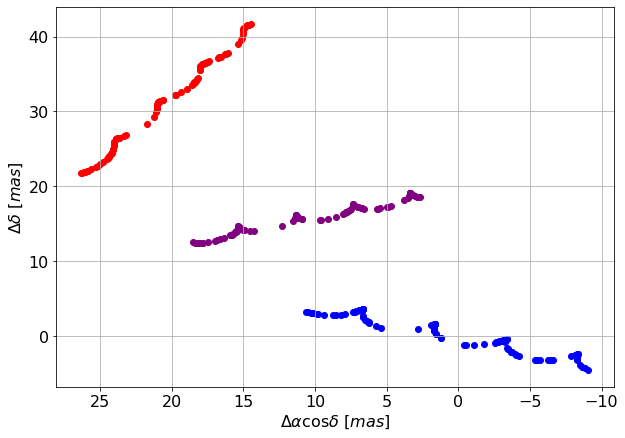
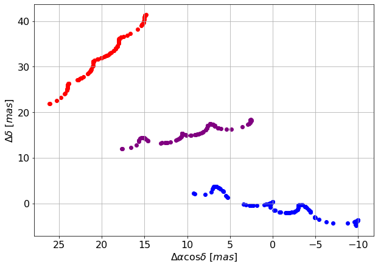

blending
========

introduction
------------

For now, we dealt with average positions of two stars bound in a binary system. But if two unrelated stars are very nearby, they can also be blended - unresolved and detected as just one light source. Blending is more frequent in dense fields, such as those in the Galactic plane and especially near the Galactic centre.
In Gaia data, we can expect light sources to be blended if they are closer than 200 mas apart. We assume that Gaia will then detect a single source, and its measured position will be a weighted average of positions of contributing stars, with weights being their fluxes.

simple tracks
-------------

We will start with two single stars following simple paths on the sky.

We first define the motion of the first star:

::

  params=astromet.params()

  # primary source parameters
  params.ra=160     #[deg]
  params.dec=-50    #[deg]
  params.drac=0     #[mas]
  params.ddec=0     #[mas]
  params.pmrac=-5    #[mas/yr]
  params.pmdec=-2   #[mas/yr]
  params.parallax=1     #[mas]

Now we are introducing new parameters - same as for the first star, but with the 'blend' index, denoting a secondary object passing by.

::

  # blend parameters
  params.blenddrac=20     #[mas]
  params.blendddec=32     #[mas]
  params.blendpmrac=-3    #[mas/yr]
  params.blendpmdec=5   #[mas/yr]
  params.blendparallax=0.5     #[mas]

Finally, let's introduce the blend light blendl, defined as the flux of the secondary source in the units of flux of our primary source. By default it is set to 0, meaning that there is no blending. Let's change it to 1, so that each star contributes half of the flux.

::

  params.blendl=1

We will define some observation times:

::

  # random times between 2014 and 2018
  ts=2014 + 4*np.random.rand(100)

and plot the tracks of the two separate stars (blue, red) and then the blended track (purple):

::

  params_primary = astromet.params()
  params_primary.ra, params_primary.dec, params_primary.parallax, params_primary.pmrac, params_primary.pmdec = params.ra, params.dec, params.parallax, params.pmrac, params.pmdec

  params_blend = astromet.params()
  params_blend.ra, params_blend.dec, params_blend.parallax, params_blend.pmrac, params_blend.pmdec = params.ra, params.dec, params.blendparallax, params.blendpmrac, params.blendpmdec
  params_blend.drac, params_blend.ddec = params.blenddrac, params.blendddec

  dracs_primary, ddecs_primary = astromet.track(ts, params_primary)
  dracs_blend, ddecs_blend = astromet.track(ts, params_blend)
  dracs, ddecs = astromet.track(ts, params)

  ax=plt.gca()
  ax.scatter(dracs_primary,ddecs_primary, color='blue')
  ax.scatter(dracs_blend,ddecs_blend, color='red')
  ax.scatter(dracs,ddecs, color='purple')
  ax.set_xlabel(r'$\Delta \alpha \cos \delta \ [mas]$')
  ax.set_ylabel(r'$\Delta \delta \ [mas]$')
  ax.invert_xaxis()
  ax.grid(True)
  plt.show()

As blending just returns a weighted average of those two tracks, the result looks just like a normal track generated with a weighted average of their parameters. This means the Gaia fit should not be unusual (we expect UWE~=1) and we should not be able to know that, in fact, we are looking at two stars. Let's test it by first creating some mock observations:

::

  ast_error=0.1 # [mas]

  obsdracs=dracs+ast_error*np.random.randn(ts.size)
  obsddecs=ddecs+ast_error*np.random.randn(ts.size)

  ax=plt.gca()
  ax.scatter(obsdracs,obsddecs,s=20, color='purple')
  ax.set_xlabel(r'$\Delta \alpha \cos \delta \ [mas]$')
  ax.set_ylabel(r'$\Delta \delta \ [mas]$')
  ax.invert_xaxis()
  ax.grid(True)
  plt.show()

and then fitting them:

::

  results = astromet.simple_fit(ts,obsdracs,obsddecs,ast_error,params.ra,params.dec)

giving:

::

  {'vis_periods': 76,
   'n_obs': 100,
   'drac': -0.011301807524057274,
   'drac_error': 0.009379378872654694,
   'ddec': -0.008445686465413424,
   'ddec_error': 0.009369235193269565,
   'drac_ddec_corr': -0.0003427894371779837,
   'parallax': 0.9997128245637159,
   'parallax_error': 0.010471455252530619,
   'drac_parallax_corr': -0.047061086997833415,
   'ddec_parallax_corr': 0.007283925192670643,
   'pmrac': -4.99922955451988,
   'pmrac_error': 0.008692598376007978,
   'drac_pmrac_corr': 0.002506295616405202,
   'ddec_pmrac_corr': 0.001323711477409411,
   'parallax_pmrac_corr': 0.18173051512684107,
   'pmdec': -2.007956151982878,
   'pmdec_error': 0.008549309567347953,
   'drac_pmdec_corr': -0.0008688384482675892,
   'ddec_pmdec_corr': 0.011390727416808143,
   'parallax_pmdec_corr': 0.018461929030827284,
   'pmrac_pmdec_corr': 0.003355095873007425,
   'UWE': 0.93683928518927,
   'ra_ref': 160,
   'dec_ref': -50}

Let's plot those results:

::

  ax=plt.gca()
  ax.scatter(obsdracs,obsddecs,s=20, color='purple')

  plotts=np.linspace(np.min(ts),np.max(ts),200)
  fitparams=astromet.params()
  lfitparams=astromet.params()

  uwe = round(results['UWE'],2)
  ax.text(0.85, 0.95, f'UWE = {uwe}', ha='center', va='center', transform=ax.transAxes, fontsize=16, fontname='serif', color='purple')

  for i in range(32):

      fitparams.ra=160     #[deg]
      fitparams.dec=-50    #[deg]
      fitparams.drac=results['drac']+results['drac_error']*np.random.randn()     #[mas]
      fitparams.ddec=results['ddec']+results['ddec_error']*np.random.randn()     #[mas]
      fitparams.pmrac=results['pmrac']+results['pmrac_error']*np.random.randn()    #[mas/yr]
      fitparams.pmdec=results['pmdec']+results['pmdec_error']*np.random.randn()   #[mas/yr]
      fitparams.parallax=results['parallax']+results['parallax_error']*np.random.randn()     #[mas]

      fitdracs,fitddecs=astromet.track(plotts,fitparams)
      ax.plot(fitdracs,fitddecs,c='purple',alpha=0.1)
  ax.set_xlabel(r'$\Delta \alpha \cos \delta \ [mas]$')
  ax.set_ylabel(r'$\Delta \delta \ [mas]$')
  ax.invert_xaxis()
  ax.grid(True)
  plt.show()

.. image:: plots/blendingSimpleFit.png
  :width: 400
  :alt: fit to the blended track

As expected, UWE is close to 1. When looking at the fit results, you can see that the recovered parameters are very close to the average of parameters of the primary star and the blend.

anomalous tracks
----------------

Let's now replace the primary star track with an anomalous one - like that of a binary star. Now, the blended track will have some deviations from the 5-parameter fit, but not as much as the original binary track; generally, the more contribution from the secondary star, the lower they will be.

::

  params.period=2   #[yr]
  params.a=5        #[AU]
  params.e=0.8
  params.q=0.5
  params.l=0.1
  # viewing angle
  params.vphi=4.5   #[rad]
  params.vtheta=1.5 #[rad]
  params.vomega=5.6 #[rad]
  # time of some periapse passage
  params.tperi=2016 #[jyear]

The figure we'll create now will again show the tracks of both light sources (blue for the binary, red for the blend star) and the blended track (purple).

::

  # primary without blending
  params.blendl = 0
  dracs, ddecs = astromet.track(ts, params)
  # blended track
  params.blendl = 1
  dracs_blended, ddecs_blended = astromet.track(ts, params)

  ax=plt.gca()
  ax.scatter(dracs, ddecs, color='blue')
  ax.scatter(dracs_blend, ddecs_blend, color='red')
  ax.scatter(dracs_blended, ddecs_blended, color='purple')
  ax.set_xlabel(r'$\Delta \alpha \cos \delta \ [mas]$')
  ax.set_ylabel(r'$\Delta \delta \ [mas]$')
  ax.invert_xaxis()
  ax.grid(True)
  plt.show()

Now, just like before, we create some mock observations and fit them:

::

  # add random error
  ast_error=0.1 # [mas]

  obsdracs=dracs+ast_error*np.random.randn(ts.size)
  obsddecs=ddecs+ast_error*np.random.randn(ts.size)

  blobsdracs=dracs_blended+ast_error*np.random.randn(ts.size)
  blobsddecs=ddecs_blended+ast_error*np.random.randn(ts.size)

::

  # fit track without blending
  results = astromet.simple_fit(ts,obsdracs,obsddecs,ast_error,params.ra,params.dec)

::

  {'vis_periods': 76,
   'n_obs': 100,
   'drac': -1.1145417529527182,
   'drac_error': 0.04879876647291026,
   'ddec': -0.9101537815632521,
   'ddec_error': 0.04874599122540063,
   'drac_ddec_corr': -0.0003427894371779837,
   'parallax': 0.9885124526381458,
   'parallax_error': 0.05448059049939434,
   'drac_parallax_corr': -0.04706108699783342,
   'ddec_parallax_corr': 0.007283925192670642,
   'pmrac': -4.873420169765144,
   'pmrac_error': 0.04522560437667363,
   'drac_pmrac_corr': 0.002506295616405203,
   'ddec_pmrac_corr': 0.0013237114774094108,
   'parallax_pmrac_corr': 0.18173051512684105,
   'pmdec': -1.9090501481976523,
   'pmdec_error': 0.044480105425525815,
   'drac_pmdec_corr': -0.0008688384482675892,
   'ddec_pmdec_corr': 0.011390727416808145,
   'parallax_pmdec_corr': 0.018461929030827284,
   'pmrac_pmdec_corr': 0.003355095873007425,
   'UWE': 4.874160871556728,
   'ra_ref': 160,
   'dec_ref': -50}

::

  # fit blended track
  blresults = astromet.simple_fit(ts,blobsdracs,blobsddecs,ast_error,params.ra,params.dec)
  blresults

::

  {'vis_periods': 76,
   'n_obs': 100,
   'drac': 9.439019210786634,
   'drac_error': 0.0257628310498575,
   'ddec': 15.550478483757178,
   'ddec_error': 0.02573496887457158,
   'drac_ddec_corr': -0.00034278943717798373,
   'parallax': 0.7222986296307579,
   'parallax_error': 0.028762494423123102,
   'drac_parallax_corr': -0.04706108699783342,
   'ddec_parallax_corr': 0.007283925192670642,
   'pmrac': -3.951556036533039,
   'pmrac_error': 0.023876415100179727,
   'drac_pmrac_corr': 0.0025062956164052025,
   'ddec_pmrac_corr': 0.0013237114774094108,
   'parallax_pmrac_corr': 0.18173051512684105,
   'pmdec': 1.542328450901017,
   'pmdec_error': 0.02348283622689142,
   'drac_pmdec_corr': -0.0008688384482675893,
   'ddec_pmdec_corr': 0.011390727416808143,
   'parallax_pmdec_corr': 0.018461929030827284,
   'pmrac_pmdec_corr': 0.0033550958730074244,
   'UWE': 2.5732655171407104,
   'ra_ref': 160,
   'dec_ref': -50}

::

  # plot both tracks
  ax=plt.gca()
  ax.scatter(obsdracs,obsddecs,s=20, color='blue')
  ax.scatter(blobsdracs,blobsddecs,s=20, color='purple')

  plotts=np.linspace(np.min(ts),np.max(ts),200)
  fitparams=astromet.params()
  blfitparams=astromet.params()

  uwe = round(results['UWE'],2)
  ax.text(0.85, 0.95, f'UWE = {uwe}', ha='center', va='center', transform=ax.transAxes, fontsize=16, fontname='serif', color='blue')

  bluwe = round(blresults['UWE'],2)
  ax.text(0.85, 0.85, f'UWE = {bluwe}', ha='center', va='center', transform=ax.transAxes, fontsize=16, fontname='serif', color='purple')

  for i in range(32):

    fitparams.ra=160     #[deg]
    fitparams.dec=-50    #[deg]
    fitparams.drac=results['drac']+results['drac_error']*np.random.randn()     #[mas]
    fitparams.ddec=results['ddec']+results['ddec_error']*np.random.randn()     #[mas]
    fitparams.pmrac=results['pmrac']+results['pmrac_error']*np.random.randn()    #[mas/yr]
    fitparams.pmdec=results['pmdec']+results['pmdec_error']*np.random.randn()   #[mas/yr]
    fitparams.parallax=results['parallax']+results['parallax_error']*np.random.randn()     #[mas]

    fitdracs,fitddecs=astromet.track(plotts,fitparams)
    ax.plot(fitdracs,fitddecs,c='blue',alpha=0.1)

    blfitparams.ra=160     #[deg]
    blfitparams.dec=-50    #[deg]
    blfitparams.drac=blresults['drac']+blresults['drac_error']*np.random.randn()     #[mas]
    blfitparams.ddec=blresults['ddec']+blresults['ddec_error']*np.random.randn()     #[mas]
    blfitparams.pmrac=blresults['pmrac']+blresults['pmrac_error']*np.random.randn()    #[mas/yr]
    blfitparams.pmdec=blresults['pmdec']+blresults['pmdec_error']*np.random.randn()   #[mas/yr]
    blfitparams.parallax=blresults['parallax']+blresults['parallax_error']*np.random.randn()     #[mas]

    blfitdracs,blfitddecs=astromet.track(plotts,blfitparams)
    ax.plot(blfitdracs,blfitddecs,c='purple',alpha=0.1)

  ax.set_xlabel(r'$\Delta \alpha \cos \delta \ [mas]$')
  ax.set_ylabel(r'$\Delta \delta \ [mas]$')
  ax.grid(True)
  ax.invert_xaxis()
  plt.show()

.. image:: plots/blendingBinaryFit.png
  :width: 400
  :alt: fit to the blended track

Blending 'dulls' the astrometric deviations, and the UWE recovered from the second fit is significantly lower than from fitting the original track.
