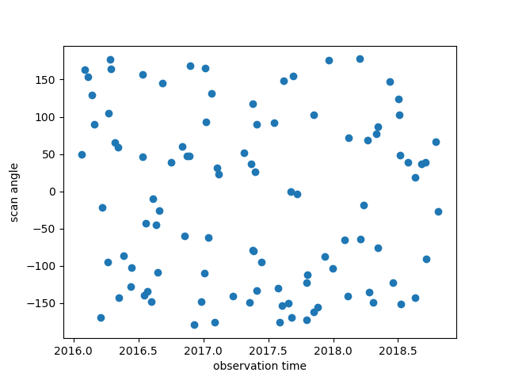
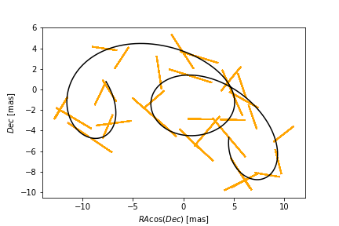
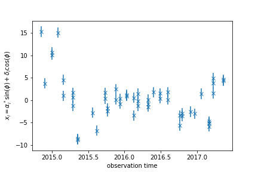

gaia_fit()
==========

In the quickstart we've shown how to generate a 2D astrometric track (in RA cos(Dec) and Dec)
and to fit a single body motion to that data.

However, this issn't a perfect replica of the data Gaia records, nor how it is fitted.

In this section we'll bridge that gap to give as exact an analog as possible to the gaia results and pipeline.

scanning angles
---------------
The first major difference is that Gaia (or any similar telescope) doesn't record positions
in any given co-ordinate system - instead the precession of the telescope means that each observation
is along a particular axis - the scanning angle.

For bright sources Gaia measures positions both along (parallel) and across (perpendicular)
to the scan direction - with the former being a much more accurate measurement than the latter
(by a factor of about 5?). For dim sources (G>13) only along scan measurements are recorded.

Working with angles such that 0 degrees points towards Equatorial North and 90 degrees towards East
we can define a set of viewing angles, or better yet use the nominal Gaia scanning-law_ to find the actual
times and angles Gaia visited a patch of sky.

::

    import astromet
    import numpy as np
    import matplotlib.pyplot as plt
    import scanninglaw.times
    from scanninglaw.source import Source

    ra=160
    dec=-50
    c=Source(ra,dec,unit='deg')

    dr3_sl=scanninglaw.times.dr2_sl(version='dr3_nominal') # slow step - run only once
    sl=dr3_sl(c, return_times=True, return_angles=True)

    ts=np.squeeze(np.hstack(sl['times']))
    sort=np.argsort(ts)
    ts=2010+ts[sort]/365.25                         # [jyr]
    phis=np.squeeze(np.hstack(sl['angles']))[sort]  # [deg]

which we can have a look at
::

    ax=plt.gca()
    ax.scatter(ts,phis)
    ax.set_xlabel(r'observation time')
    ax.set_ylabel(r'scan angle')
    plt.show()

of course if we want to skip this step it's not the end of the world to generate randomly
distributed ts and phis - but as we can see there is some structure here we'd miss out on.

Let's generate a fresh astrometric track (see the quickstart for more details)
::
    params=astromet.params()

    params.ra=ra
    params.dec=dec
    params.drac=0
    params.ddec=0
    params.pmrac=8
    params.pmdec=-2
    params.pllx=5

    params.period=2
    params.a=2
    params.e=0.8
    params.q=0.5
    params.l=0.1

    params.vphi=4.5
    params.vtheta=1.5
    params.vomega=5.6

    params.tperi=2016

    racs,decs=astromet.track(ts,params)

(this is the same system as the orange binary in quickstart)

Now we want to project the true positions (racs,decs) along our scanning angle and
add some random errors - let's assume we only have along scan measurements
(across scan barely contribute due to larger error anyway). If we know the magnitude
we can even use appropriate Gaia-like astrometric error!

::

    mag=18
    al_error=astromet.sigma_ast(mag) # about 1.1 mas at this magnitude
    errs=al_error*np.random.randn(phis.size)

    radphis=np.deg2rad(phis)

    obsracs=racs+errs*np.sin(radphis)
    obsdecs=decs+errs*np.cos(radphis)

    plotts=np.linspace(np.min(ts),np.max(ts),1000)
    plotracs,plotdecs=astromet.track(plotts,params)

    ax=plt.gca()
    for i in range(ts.size):
        ax.plot([obsracs-al_error*np.sin(radphis),obsracs+al_error*np.sin(radphis)],
                [obsdecs-al_error*np.cos(radphis),obsdecs+al_error*np.cos(radphis)],c='b')
    ax.plot(plotracs,plotdecs,c='k')
    ax.set_xlabel(r'$RA \cos(Dec)$ [mas]')
    ax.set_ylabel(r'$Dec$ [mas]')
    plt.show()

which gives the true c.o.l. track in black, and the 1D observations in orange

we can now fit our 1D positions (along the scanning line) by projecting the rac
and dec along the scan directions

::

    xs=obsracs*np.sin(radphis) + obsdecs*np.cos(radphis)

    ax=plt.gca()
    ax.errorbar(ts,xs,yerr=al_error,fmt='x')
    ax.set_xlabel(r'observation time')
    ax.set_ylabel(r'$x_i = \alpha^*_i\ \sin(\phi) + \delta_i\ \cos(\phi)$')
    plt.show()

this isn't the most illuminating plot, but this is the space Gaia actually fits in:

fitting
-------

We've done all the hard work so now let's actually fit the system
::

    bresults=astromet.gaia_fit(ts,xs,phis,al_error,ra,dec)

giving
::

    {'astrometric_matched_transits': 53,
    'visibility_periods_used': 27,
    'astrometric_n_obs_al': 477,
    'astrometric_params_solved': 31,
    'drac': -2.481421682613298,
    'drac_error': 0.10330412078579548,
    'ddec': -2.0822725280167207,
    'ddec_error': 0.11616733166796216,
    'drac_ddec_corr': 0.24939965421383536,
    'parallax': 0.9112533540683432,
    'parallax_error': 0.13907356133507548,
    'drac_parallax_corr': 0.08235084909701362,
    'ddec_parallax_corr': -0.02169689621021175,
    'pmrac': 4.545562076801453,
    'pmrac_error': 0.13649396642644182,
    'drac_pmrac_corr': -0.19745338313101343,
    'ddec_pmrac_corr': 0.0018445384883175732,
    'parallax_pmrac_corr': -0.21826409282824877,
    'pmdec': 7.545692663911277,
    'pmdec_error': 0.15000644543322567,
    'drac_pmdec_corr': -0.0095170601930002,
    'ddec_pmdec_corr': -0.27082042039288146,
    'parallax_pmdec_corr': -0.03590654299703582,
    'pmrac_pmdec_corr': 0.22016438959432935,
    'astrometric_excess_noise': 1.0664866591921252,
    'astrometric_chi2_al': 1184.8841763027692,
    'astrometric_n_good_obs_al': 477,
    'UWE': 1.5844077225101925}

.. _scanning-law: https://github.com/gaiaverse/scanninglaw

https://ui.adsabs.harvard.edu/abs/2012A%26A...538A..78L/abstract
