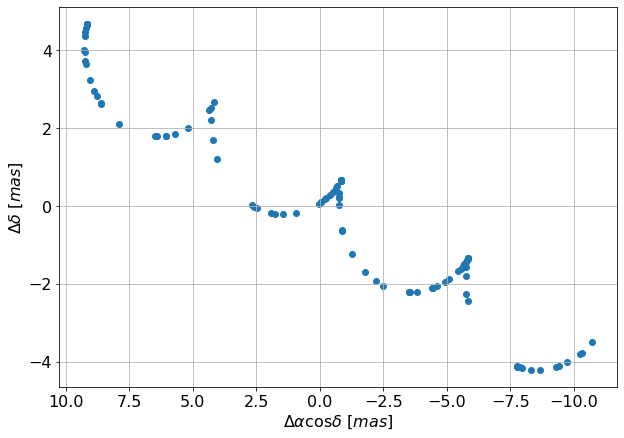
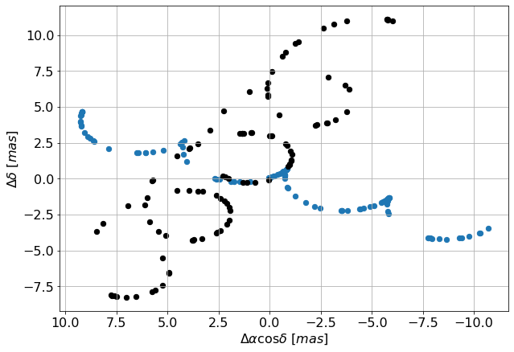
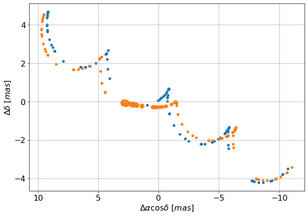
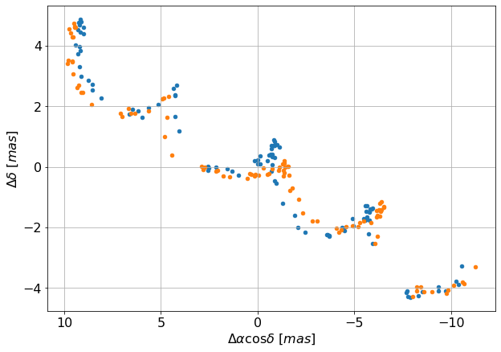
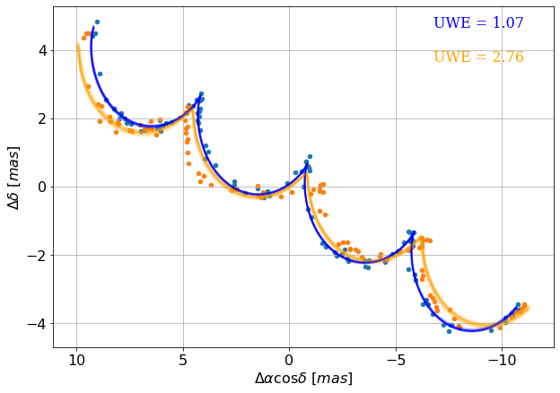
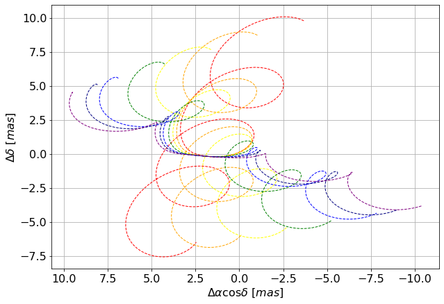
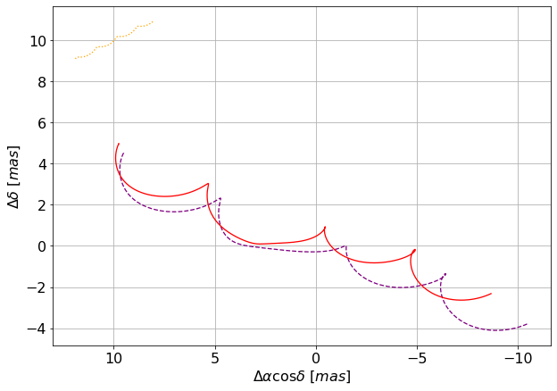

lensing
=======

introduction
------------

On the previous page we introduced a secondary object passing by and blending with its light. In some rare cases of two objects passing very closeby on the sky, we might also deal with a phenomenon called gravitational microlensing. We will discuss it on this page.

When another object from our Galaxy passes in front of the source star, its mass causes the light rays from that star to get deflected. Two uneven, amplified images of the source are created in this process - but they are typically way too close (~milliarcseconds away) to be resolved.

What we would see in astrometry is the weighted average of the positions of those images (and possibly also the luminous lens) which deviates from the source position.

In the following page, we will first plot the track of the source that we would see if the lens didn't deflect its light. Then we will take into account the lensing effect and recover the track that we will actually see. Unlike in the example with binary systems, we will deal with changes in brightness caused by the lensing; we will recover them too, as they might influence accuracy of the astrometric observations.

single body
-----------

Let's plot the single body track first.

::

  # light source parameters
  params.ra=160     #[deg]
  params.dec=-50    #[deg]
  params.drac=0     #[mas]
  params.ddec=0     #[mas]
  params.pmrac=8    #[mas/yr]
  params.pmdec=-2   #[mas/yr]
  params.parallax=5     #[mas]

We will define some times at which we want the positions:

::

  # random times between 2014 and 2018
  ts=2014 + 4*np.random.rand(100)

find the track:

::

  dracs, ddecs = astromet.track(params,ts)

and plot it:

::

  ax=plt.gca()
  ax.scatter(dracs,ddecs)
  ax.set_xlabel(r'$\Delta \alpha \cos \delta \ [mas]$')
  ax.set_ylabel(r'$\Delta \delta \ [mas]$')
  ax.grid(True)
  ax.invert_xaxis()
  plt.show()

lensed track
------------

Now let's add the lens into the equation by defining analogous parameters for it:

::

  # lens parameters
  params.blenddrac=2     #[mas]
  params.blendddec=1     #[mas]
  params.blendpmrac=3    #[mas/yr]
  params.blendpmdec=-4   #[mas/yr]
  params.blendparallax=3     #[mas]

We can have a look at paths of boths objects on the sky:

::

  # plot both tracks
  params_source = astromet.params()
  params_source.ra, params_source.dec, params_source.parallax, params_source.pmrac, params_source.pmdec = params.ra, params.dec, params.parallax, params.pmrac, params.pmdec
  params_lens = astromet.params()
  params_lens.ra, params_lens.dec, params_lens.parallax, params_lens.pmrac, params_lens.pmdec = params.ra, params.dec, params.blendparallax, params.blendpmrac, params.blendpmdec
  params_lens.drac, params_lens.ddec = params.blenddrac, params.blendddec

  drac_source, ddec_source = astromet.track(ts, params_source)
  drac_lens, ddec_lens = astromet.track(ts, params_lens)

  ax=plt.gca()

  ax.scatter(drac_source, ddec_source, s=40, zorder=0, label="source - with no lensing")
  ax.scatter(drac_lens, ddec_lens, color='black', s=40, zorder=0, label="lens")

  ax.set_xlabel(r'$\Delta \alpha \cos \delta \ [mas]$')
  ax.set_ylabel(r'$\Delta \delta \ [mas]$')
  ax.grid(True)
  #plt.axis('equal')
  ax.invert_xaxis()

  plt.show()

It is not enough to know the path of the lens, though - we must also know how strong the effect of deflection of the light will be. A more massive or more nearby lens will cause a stronger deflection.
Generally, a parameter used to measure the scale of this deflection is the *angular Einstein radius* :math:`\theta_E` [mas].
(For a detailed description of the lensing geometry see Paczyński 1996: https://arxiv.org/abs/astro-ph/9604011)

::

  params.thetaE=2.5     #[mas]

We find the track:

::

  ldracs, lddecs, mag_diff = astromet.track(ts,params)

Note that for a lensing event in addition to the position we also get the change in magnitude at each time.
We might need this information later to assume realistic errors, as Gaia measures brighter sources more accurately.

We will now plot the track, using the same times as above and showing the changes in brightness with dot sizes:

::

  ax=plt.gca()
  ax.scatter(dracs,ddecs, s=20)
  ax.scatter(ldracs,lddecs, s=20/10**(mag_diff/2))
  ax.set_xlabel(r'$\Delta \alpha \cos \delta \ [mas]$')
  ax.set_ylabel(r'$\Delta \delta \ [mas]$')
  ax.grid(True)
  ax.invert_xaxis()
  plt.show()

You can clearly see a deviation in the track! The difference in the observed motion is most dramatic when the source and the lens are very close - which is also when the brightness reaches the peak - but slight deviations will be seen long before and after it.

fits
----

Now we will compare the results of a simple fit for both of those tracks. Let's create some mock observations:

::

  ast_error=0.1 # [mas]

  obsdracs=dracs+ast_error*np.random.randn(ts.size)
  obsddecs=ddecs+ast_error*np.random.randn(ts.size)

  lobsdracs=ldracs+ast_error*np.random.randn(ts.size)
  lobsddecs=lddecs+ast_error*np.random.randn(ts.size)

  ax=plt.gca()
  ax.scatter(obsdracs,obsddecs,s=20)
  ax.scatter(lobsdracs,lobsddecs,s=20)
  ax.set_xlabel(r'$\Delta \alpha \cos \delta \ [mas]$')
  ax.set_ylabel(r'$\Delta \delta \ [mas]$')
  ax.grid(True)
  ax.invert_xaxis()
  plt.show()

and fit them:

::

  results = astromet.simple_fit(ts,obsdracs,obsddecs,ast_error,params.ra,params.dec)

::

   {'vis_periods': 73,
   'n_obs': 100,
   'drac': -0.00012858938281912202,
   'drac_error': 0.010772359854324101,
   'ddec': -0.011393470223190788,
   'ddec_error': 0.010872882457107928,
   'drac_ddec_corr': -0.011876981889627856,
   'parallax': 1.0101995671595339,
   'parallax_error': 0.01195304888242362,
   'drac_parallax_corr': -0.07644165428062193,
   'ddec_parallax_corr': 0.15537316665108708,
   'pmrac': -5.016202103372685,
   'pmrac_error': 0.009497307841422052,
   'drac_pmrac_corr': -0.06241342583946865,
   'ddec_pmrac_corr': 0.010344679558026041,
   'parallax_pmrac_corr': 0.06657957600398604,
   'pmdec': -1.9983779212526642,
   'pmdec_error': 0.009478128764920015,
   'drac_pmdec_corr': 0.0015282324840945477,
   'ddec_pmdec_corr': -0.060015163712328866,
   'parallax_pmdec_corr': -0.01999214300732313,
   'pmrac_pmdec_corr': -0.0013310684048386283,
   'UWE': 1.0722995542218234,
   'ra_ref': 160,
   'dec_ref': -50}

::

  lresults = astromet.simple_fit(ts,lobsdracs,lobsddecs,ast_error,params.ra,params.dec)

::

   {'vis_periods': 73,
   'n_obs': 100,
   'drac': -0.025658979845120777,
   'drac_error': 0.027757121731364916,
   'ddec': -0.1845796667338721,
   'ddec_error': 0.028016138154874415,
   'drac_ddec_corr': -0.011876981889627854,
   'parallax': 0.8544357662428543,
   'parallax_error': 0.030799401187587328,
   'drac_parallax_corr': -0.07644165428062193,
   'ddec_parallax_corr': 0.15537316665108708,
   'pmrac': -5.379123566488673,
   'pmrac_error': 0.024471697329047203,
   'drac_pmrac_corr': -0.062413425839468656,
   'ddec_pmrac_corr': 0.01034467955802604,
   'parallax_pmrac_corr': 0.06657957600398602,
   'pmdec': -1.884874633292816,
   'pmdec_error': 0.024422278634502897,
   'drac_pmdec_corr': 0.0015282324840945477,
   'ddec_pmdec_corr': -0.06001516371232886,
   'parallax_pmdec_corr': -0.01999214300732313,
   'pmrac_pmdec_corr': -0.0013310684048386283,
   'UWE': 2.762992479041259,
   'ra_ref': 160,
   'dec_ref': -50}

The fits look like this:

::

  ax=plt.gca()
  ax.scatter(obsdracs,obsddecs,s=20)
  ax.scatter(lobsdracs,lobsddecs,s=20)

  plotts=np.linspace(np.min(ts),np.max(ts),200)
  fitparams=astromet.params()
  lfitparams=astromet.params()

  uwe = round(results['UWE'],2)
  ax.text(0.85, 0.95, f'UWE = {uwe}', ha='center', va='center', transform=ax.transAxes, fontsize=16, fontname='serif', color='blue')

  luwe = round(lresults['UWE'],2)
  ax.text(0.85, 0.85, f'UWE = {luwe}', ha='center', va='center', transform=ax.transAxes, fontsize=16, fontname='serif', color='orange')

  for i in range(32):

    fitparams.ra=160     #[deg]
    fitparams.dec=-50    #[deg]
    fitparams.drac=results['drac']+results['drac_error']*np.random.randn()     #[mas]
    fitparams.ddec=results['ddec']+results['ddec_error']*np.random.randn()     #[mas]
    fitparams.pmrac=results['pmrac']+results['pmrac_error']*np.random.randn()    #[mas/yr]
    fitparams.pmdec=results['pmdec']+results['pmdec_error']*np.random.randn()   #[mas/yr]
    fitparams.parallax=results['parallax']+results['parallax_error']*np.random.randn()     #[mas]

    fitdracs,fitddecs=astromet.track(plotts,fitparams)
    ax.plot(fitdracs,fitddecs,c='blue',alpha=0.1)

    lfitparams.ra=160     #[deg]
    lfitparams.dec=-50    #[deg]
    lfitparams.drac=lresults['drac']+lresults['drac_error']*np.random.randn()     #[mas]
    lfitparams.ddec=lresults['ddec']+lresults['ddec_error']*np.random.randn()     #[mas]
    lfitparams.pmrac=lresults['pmrac']+lresults['pmrac_error']*np.random.randn()    #[mas/yr]
    lfitparams.pmdec=lresults['pmdec']+lresults['pmdec_error']*np.random.randn()   #[mas/yr]
    lfitparams.parallax=lresults['parallax']+lresults['parallax_error']*np.random.randn()     #[mas]

    lfitdracs,lfitddecs=astromet.track(plotts,lfitparams)
    ax.plot(lfitdracs,lfitddecs,c='orange',alpha=0.1)

  ax.set_xlabel(r'$\Delta \alpha \cos \delta \ [mas]$')
  ax.set_ylabel(r'$\Delta \delta \ [mas]$')
  ax.grid(True)
  ax.invert_xaxis()
  plt.show()

Lensing significantly changed the measurements of all 5 astrometric parameters (positions in RA and DEC, proper motions in RA and DEC and parallax) and introduced a high Unit Weight Error, meaning that the 5-parameter fit couldn't reproduce the track well!

blending
--------

We left out the final parameter that you can optionally tweak - blendl. It is defined as the flux coming from the lens in the units of flux coming from the source *at baseline*. We discussed blending in more detail on the previous page.
By default, blendl is set to 0, which means that the lens contributes no light.

::

  params.blendl=0

Let's demonstrate how our track will change with varying the blending parameter from 5 (lens 5x brighter than the source star) to 0 (no light from the lens).

::

  colors = ['red', 'orange', 'yellow', 'green', 'blue', 'navy', 'purple']
  blendls = [5, 2, 1, 0.5, 0.2, 0.1, 0]
  ax = plt.gca()
  for i in range(7):
      params.blendl = blendls[i]
      ldracs, lddecs, mag_diff = astromet.track(plotts,params)
      ax.plot(ldracs, lddecs, color=colors[i], lw=1, ls='--')
  ax.set_xlabel(r'$\Delta \alpha \cos \delta \ [mas]$')
  ax.set_ylabel(r'$\Delta \delta \ [mas]$')
  ax.grid(True)
  ax.invert_xaxis()
  plt.show()

Starting from the unblended (purple) track, the more we increase blendl, the closer we are getting to the path of the lens, and the less we see the deviations from a simple 5-parameter (straight line proper motion + parallax) path.

Above, our secondary source in the track() function was the lens. It is only possible to define a primary and secondary source there - but if you want to blend your lensed track with a third object, you can do it afterwards using the blend() function. Keep in mind that as the brightness of our event changes with lensing, so will the light ratio.
Let's use our unblended, purple track and add a background star with a defined trajectory contributing about 10% of the light:

::

  params_bg_star = astromet.params()

  # regular astrometric parameters
  params_bg_star.ra=160     #[deg]
  params_bg_star.dec=-50    #[deg]
  params_bg_star.drac=10    #[mas]
  params_bg_star.ddec=10    #[mas]
  params_bg_star.pmrac=-1    #[mas/yr]
  params_bg_star.pmdec=0.5  #[mas/yr]
  params_bg_star.parallax=0.1     #[mas]

  # create tracks of lensed primary source and background star
  ldracs, lddecs, mag_diff = astromet.track(ts_dense,params)
  track_bg_star_dracs, track_bg_star_ddecs = astromet.track(ts_dense,params_bg_star)

  # define the blend light at baseline
  blendl = 0.11

  # adjust the light ratios at different epochs to correct for amplification
  f_ampl = 10**(-mag_diff/2.5)
  light_ratios = blendl/f_ampl # blend light : source light (amplified)

  #final blended track
  bldracs, blddecs = astromet.blend(ldracs, lddecs, track_bg_star_dracs, track_bg_star_ddecs, light_ratios)

  # plot
  ax = plt.gca()
  ax.plot(ldracs, lddecs, color='purple', lw=1.3, ls='--', alpha=1)
  ax.plot(track_bg_star_dracs, track_bg_star_ddecs, color='orange', ls=':', lw=1.3, alpha=1)
  ax.plot(bldracs, blddecs, color='red', lw=1.3, alpha=1)
  ax.set_xlabel(r'$\Delta \alpha \cos \delta \ [mas]$')
  ax.set_ylabel(r'$\Delta \delta \ [mas]$')
  ax.grid(True)
  ax.invert_xaxis()
  plt.show()

lensed binaries
---------------

If you set both the binary parameters and the lensing parameters, you will end up with a track of a lensed binary system. Those tracks can be very interesting and complicated; potentially, lensed binaries could be responsible for some events where fitting a photometric model of a single lensed star doesn't work well. Use with caution as this part has not been fully tested; if you do use it, we encourage you to let us know how it's working!

.. image:: plots/lensedBinary.png
  :width: 400
  :alt: lensed tracks of a binary star

notes for microlensers
----------------------

If you prefer to operate in the standard microlensing parameters from the photometric model (u0, t0, tE, piEN, piEE, m0, fbl), you can easily create a track using them. Note that, because of degeneracies, those parameters are not enough to define an astrometric track, and you have to also assume some value of :math:`\theta_E` and enter the astrometry of the source (pmrac_source, pmdec_source, d_source).

::
  params = astromet.params()
  params = astromet.define_lens(params, u0, t0, tE, piEN, piEE, m0, fbl, pmrac_source, pmdec_source, d_source, thetaE)
  drac, ddec, mag_diff = astromet.track(ts, params)

Alternatively, if you have previously defined :math:`\theta_E`, as well as the proper motions and parallaxes of the source and the lens, and just want to get the offset between those tracks, you can call:

::
  params = astromet.get_offset(params, u0, t0)

which overwrites the lens position at the reference epoch to match :math:`\u_0` and :math:`\t_0`.

Use parameters defined in the heliocentric frame for that!

limitations
-----------

The code operates assuming the point source - point lens (PSPL) model. This means that it is not applicable to binary (or further multiples) lensing events, or lensing by diffuse objects. It is also not applicable in general to events displaying finite source effects.

In case you would like to simulate hypothetical very extreme events with image-image or light center-lens separations > 200 mas, please note that such events could be resolved and registered as separate sources by Gaia, and the resulting mock observations and fits will not be realistic.
