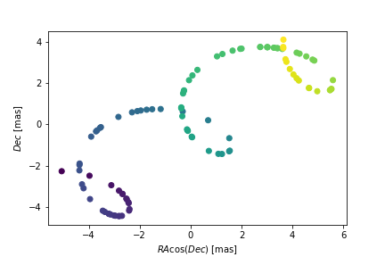
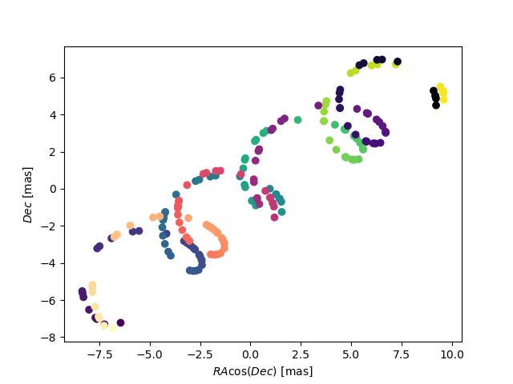
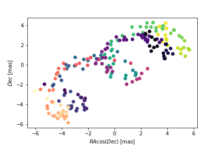
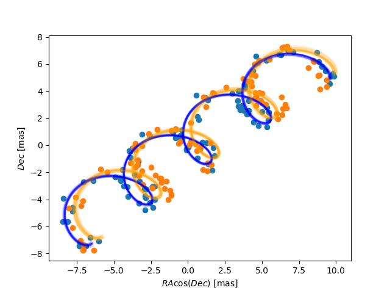

quickstart
==========
a note on coordinates
---------------------

We generally record the position of astronomical objects in a spherical
 coordinate system, such as Right Ascension and Declination (or in an ideal
 world for astrometry Ecliptic Longitude and Latitude).

 This is *not* a euclidean geometry - Pythagoras theorem (and all our normal
 concepts of distance) are approximately true on the equator, but increasingly
 fall apart towards the poles.

 This is why in much of this package we'll work in coordinates RA cos(Dec) and Dec,
 which *are* euclidean. Confusingly lots of astrometric data is given in a combination
 of these two systems. For example proper motion is almost always recorded in the
 euclidean system, and Gaia returns position as RA [deg] but error as the uncertainty
 in RA cos(Dec) [mas].

Rather than work in global coordinates (in degrees) we'll work in some local
displacement relative to some initial approximate RA and Dec - these are needed
to define the parallax ellipse but only need be accurate to arcsecond level.

The actual tracks and fitting are expressed in local delta RA cos(Dec) and delta Dec
(drac and ddec for short) in milli-arcseconds - which is a much more appropriate
unit for the motion of stars.

single body
-----------
Let's start with a simple single body example:
::

    import astromet
    import numpy as np

    # an object which holds all the necessary parameters to generate a track
    params=astromet.params()

    # center of mass parameters
    params.ra=160     #[deg]
    params.dec=-50    #[deg]
    params.drac=0     #[mas]
    params.ddec=0     #[mas]
    params.pmrac=8    #[mas/yr]
    params.pmdec=-2   #[mas/yr]
    params.parallax=1     #[mas]

All we need now is some times at which we want to find the position
::

    # random times between 2014 and 2018
    ts=2014 + 4*np.random.rand(100)

and we can find the track
::

    # finds the exact position in RAcos(Dec) and Dec [mas]
    racs,decs=astromet.track(ts,params)

and plot it
::

    ax=plt.gca()
    ax.scatter(racs,decs)
    ax.set_xlabel(r'$RA \cos(Dec)$ [mas]')
    ax.set_ylabel(r'$Dec$ [mas]')
    plt.show()

binary system
-------------

A binary system behaves in exactly the same way, just with a few extra parameters
to fully define the motion of the centre of light around the centre of masses

We can use the same params object as before and just adjust the other parameters

::

    # binary parameters
    # (for single stars leave these blank or set l=q)
    params.period=2   #[yr]
    params.a=2        #[AU]
    params.e=0.8
    params.q=0.5
    params.l=0.1
    # viewing angle
    params.vphi=4.5   #[rad]
    params.vtheta=1.5 #[rad]
    params.vomega=5.6 #[rad]
    # time of some periapse passage
    params.tperi=2016 #[jyear]

we've actually been working with a binary system the whole time, but the default is to set
q=l(=0), meaning the centre of light sits atop the centre of mass always and we don't see
any excess motion.

Let's compare the one-body motion with this binary system (we'll add a b to the names
of all variables involving the binary)

::

    bracs,bdecs=astromet.track(ts,params)

    ax=plt.gca()
    ax.scatter(racs,decs)
    ax.scatter(bracs,bdecs)
    ax.set_xlabel(r'$RA \cos(Dec)$ [mas]')
    ax.set_ylabel(r'$Dec$ [mas]')
    plt.show()

giving

a simple fit
------------

astromet.py is a package in two halves. The first we've already seen, simulating an astrometric track
for a known system. The second, related but independent, is for fitting an astrometric model to
an an astrometric track.

We'll start with a very simple fit - to our 2D data (and later move onto a fit much closer to realistic
observations as we'd observe in Gaia).

First let's add some random error to both tracks:

::

    ast_error=0.3 # [mas]

    obsracs=racs+ast_error*np.random.randn(ts.size)
    obsdecs=decs+ast_error*np.random.randn(ts.size)

    bobsracs=bracs+ast_error*np.random.randn(ts.size)
    bobsdecs=bdecs+ast_error*np.random.randn(ts.size)

    ax=plt.gca()
    ax.scatter(obsracs,obsdecs)
    ax.scatter(bobsracs,bobsdecs)
    ax.set_xlabel(r'$RA \cos(Dec)$ [mas]')
    ax.set_ylabel(r'$Dec$ [mas]')
    plt.show()

Then we can fit a single body model (remember we still have to supply approximate
 RA and Dec for the parallax ellipse)
::

    results = astromet.simple_fit(ts,obsracs,obsdecs,ast_error,params.ra,params.dec)
giving
::
   {'vis_periods': 74,
   'n_obs': 100,
   'drac': -0.009982054996942186,
   'drac_error': 0.030180777265569076,
   'ddec': -0.013148563085311177,
   'ddec_error': 0.03017953203751618,
   'drac_ddec_corr': 0.00013358495024689537,
   'parallax': 4.999733625222756,
   'parallax_error': 0.025740848099767042,
   'drac_parallax_corr': 0.05870691132052432,
   'ddec_parallax_corr': -0.0015343400075869971,
   'pmra': 8.049559483605737,
   'pmra_error': 0.02551389002885625,
   'drac_pmra_corr': 0.0010801513007877486,
   'ddec_pmra_corr': 0.062126757314268345,
   'parallax_pmra_corr': -0.012406482556475676,
   'pmdec': -1.9926893944343775,
   'pmdec_error': 0.04148940631653204,
   'drac_pmdec_corr': 0.01345600472104839,
   'ddec_pmdec_corr': 0.009927534436572898,
   'parallax_pmdec_corr': -0.15455398491840128,
   'pmra_pmdec_corr': 0.08027280929072023,
   'UWE': 1.0040287275558353}
Let's unpick a few of these values. We observe at 100 times ('n_obs').
Only 74 ('vis_periods') of our observations are spaced by more than 4 days.
Using the parallax as our example we have: parallax=4.999733625222756 +- 0.025740848099767042
('parallax'+-'parallax_error'), which as we should expect is consistent with the true value
we chose for this system. Finally we have an Unit Weight Error ('UWE' - effectively the
reduced-chi-squared) of almost exactly 1 - our model is a good fit consistent with the errors.

We can do the same for the binary system
::

    bresults = astromet.simple_fit(ts,bobsracs,bobsdecs,ast_error,params.ra,params.dec)
giving
::

    {'vis_periods': 74,
    'n_obs': 100,
    'drac': -2.251177716178904,
    'drac_error': 0.1289215261663215,
    'ddec': -1.840590304658127,
    'ddec_error': 0.12891620699579145,
    'drac_ddec_corr': 0.00013358495024689534,
    'parallax': 5.080782183819464,
    'parallax_error': 0.1099557308493609,
    'drac_parallax_corr': 0.058706911320524316,
    'ddec_parallax_corr': -0.0015343400075869971,
    'pmra': 8.09169297680413,
    'pmra_error': 0.10898624684236802,
    'drac_pmra_corr': 0.0010801513007877486,
    'ddec_pmra_corr': 0.06212675731426835,
    'parallax_pmra_corr': -0.012406482556475676,
    'pmdec': -1.9170680485651224,
    'pmdec_error': 0.1772279598698093,
    'drac_pmdec_corr': 0.013456004721048388,
    'ddec_pmdec_corr': 0.009927534436572898,
    'parallax_pmdec_corr': -0.15455398491840128,
    'pmra_pmdec_corr': 0.08027280929072023,
    'UWE': 1.286655887610263}
Comparing the two we see that the binary added a significant position offset
and the proper motions and parallax have been shifted by almost one sigma.
Finally the UWE now is significantly > 1, the best 5-parameter fit cannot mimic
the extra binary motion.

To finish we can plot the ensemble of estimated fits on the astrometric track
to see how good both fits are:
::

    ax=plt.gca()
    ax.scatter(obsracs,obsdecs)
    ax.scatter(bobsracs,bobsdecs)

    plotts=np.linspace(np.min(ts),np.max(ts),200)
    fitparams=astromet.params()
    bfitparams=astromet.params()
    for i in range(32):

    fitparams.ra=160     #[deg]
    fitparams.dec=-50    #[deg]
    fitparams.drac=results['drac']+results['drac_error']*np.random.randn()     #[mas]
    fitparams.ddec=results['ddec']+results['ddec_error']*np.random.randn()     #[mas]
    fitparams.pmrac=results['pmrac']+results['pmrac_error']*np.random.randn()    #[mas/yr]
    fitparams.pmdec=results['pmdec']+results['pmdec_error']*np.random.randn()   #[mas/yr]
    fitparams.parallax=results['parallax']+results['parallax_error']*np.random.randn()     #[mas]

    fitracs,fitdecs=astromet.track(plotts,fitparams)
    ax.plot(fitracs,fitdecs,c='blue',alpha=0.1)

    bfitparams.ra=160     #[deg]
    bfitparams.dec=-50    #[deg]
    bfitparams.drac=bresults['drac']+bresults['drac_error']*np.random.randn()     #[mas]
    bfitparams.ddec=bresults['ddec']+bresults['ddec_error']*np.random.randn()     #[mas]
    bfitparams.pmrac=bresults['pmrac']+bresults['pmrac_error']*np.random.randn()    #[mas/yr]
    bfitparams.pmdec=bresults['pmdec']+bresults['pmdec_error']*np.random.randn()   #[mas/yr]
    bfitparams.parallax=bresults['parallax']+bresults['parallax_error']*np.random.randn()     #[mas]

    bfitracs,bfitdecs=astromet.track(plotts,bfitparams)
    ax.plot(bfitracs,bfitdecs,c='orange',alpha=0.1)

    ax.set_xlabel(r'$RA \cos(Dec)$ [mas]')
    ax.set_ylabel(r'$Dec$ [mas]')
    plt.show()

giving

And there we go, we've fit (well) a single star and (poorly) a binary star
astrometric track. The last remaining piece is to make our observations more
realistic - with particular scan directions and greater precision in the
along scan direction compared to across scan - and to use the similar but more
in-depth replice of Gaia's own astrometric fitting function in fit().

We'll save that discussion for another page.

postscript - epoch
-----------------

One final detail We left out here is the ability to set an epoch - the
specific time at which values the value of drac, ddec, pmrac and pmdec are
calculated.

If you're making a track you can set
::

    params.epoch = 2016   # [jyr] - the default, corresponding to eDR3

And if you're fitting you can add the optional epoch argument
::

    simple_fit(..., epoch=2015.5) # the DR2 epoch
